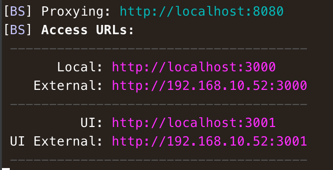

# Kent Hack Enough 2017 Attendee Site

<p align="center">
  
</p>

Built with:
* [Vue.js 2](https://github.com/vuejs/vue)
* [Vue Router 2](https://github.com/vuejs/vue-router)
* [Axios](https://github.com/mzabriskie/axios)
* [Animate.css](https://github.com/daneden/animate.css)
* [Babel](https://babeljs.io/)
* [BrowserSync](https://www.browsersync.io/)
* [ESLint](http://eslint.org/)
* [JSONPlaceholder](http://jsonplaceholder.typicode.com/)
* [SASS](http://sass-lang.com/)
* [Webpack 2](https://webpack.js.org/)
* [Yarn](https://yarnpkg.com/en/docs/install)
* ...and many more

## Getting started

1. Be sure you have [Yarn](https://yarnpkg.com/en/docs/install) installed globally.
2. Clone the repo & run `yarn` from the project root

## Single File Components
See [instructions](docs/single-file-components.md) for example usage of [single file components](https://vuejs.org/v2/guide/single-file-components.html).

## Available commands

```sh
yarn start
```

Runs the Webpack module-bundler, starts watching for changes & launches the BrowserSync server to [http://localhost:3000](http://localhost:3000) (it's possible to change the port from `package.json` config-section). Uses [Webpack Dashboard](https://github.com/FormidableLabs/webpack-dashboard)

**Note!** Webpack handles all the reloading stuff while BrowserSync just proxies the default webpack-port (`8080`) giving the possibility to connect to dev-server from multiple devices:



```sh
yarn lint:js
```

Lints javascript-files inside `/src` directory

```sh
yarn validate:dev
```

Validates Webpack development configuration (useful if you add plugins / loaders)

```sh
yarn validate:prod
```

Validates Webpack production configuration (useful if you add plugins / loaders)

```sh
yarn build
```

Runs the webpack module-bundler with production-settings (compress etc.) and builds the project to `/build` directory.

## Get Involved
Feel free to fork the repo and make changes. We're happy to review pull requests and issues.
You may also join our Slack team here: https://khe.slack.com/signup

### Keep your fork updated
As we do work on the repo, you'll notice that your fork might not have all the latest stuff!
We need add the main repo as a remote source to your fork. It's pretty easy.  

Clone your fork and run the following command:
```
git remote add upstream https://github.com/hacksu/2017-kenthackenough-ui-main.git
```

Now to pull changes from the `develop` branch it's as easy as running
```
git pull upstream develop
```

It's important to note we only do this for pulling the latest code from the main repository. 
Any time you want to have some new code included in the project you still need to submit a pull request to the `develop` branch.